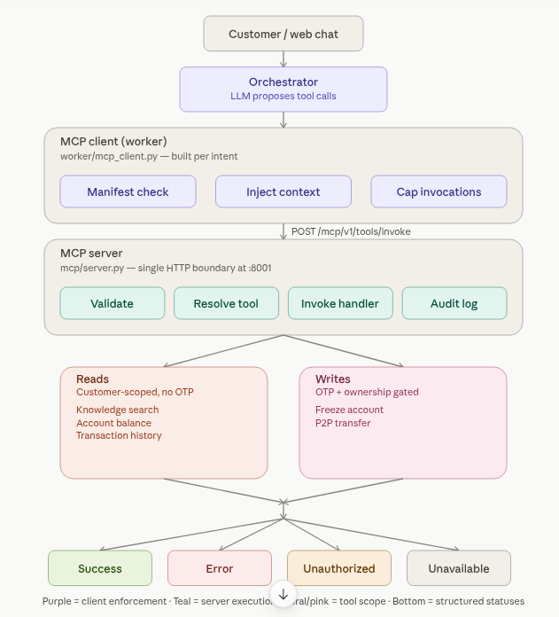

# ACSP · Agentic Customer Service Pipeline

**A Zero-Trust Model Context Protocol (MCP) Control Plane for Regulated Financial AI**

[](https://www.python.org/downloads/)
[](docs/mcp-architecture.md)
[](docs/mcp-architecture.md)
[](LICENSE)

Prototype reference for banking/wallet customer service: agents reason in natural language; **enterprise truth and side effects only cross MCP**.

---

## The Core Rule

> **The model proposes. The platform tokenizes, authorizes, executes, and audits.**

Standard desktop MCP demos often wire an LLM straight to tools with global discovery and prompt-only safety. That is not enough for fintech:

| Playground MCP | ACSP Zero-Trust Control Plane |
|----------------|-------------------------------|
| Global auto-discovery of tools | **Intent-scoped manifests** (`tool_permissions.yaml`) |
| Raw PII / secrets in model context | **Spatial tokenization** before the LLM (`[ACC_A1B2]`) |
| Identity trusted from the prompt | **Platform-injected** `customerContext` |
| Writes as “just another tool call” | **OTP step-up** on state-modifying tools |
| Failures as free text | Structured statuses: `SUCCESS` / `ERROR` / `UNAUTHORIZED` / `UNAVAILABLE` |

```text
       Traditional Agent                      ACSP Zero-Trust Control Plane
┌───────────────────────────────┐          ┌───────────────────────────────────┐
│ LLM ──► Direct DB / Raw Tools │    VS    │ LLM Proposes ──► Tokenizer Vault  │
│       (Prompt-only Safety)    │          │              ──► Intent Manifest  │
└───────────────────────────────┘          │              ──► MCP Execution    │
                                           │              ──► OTP + Audit      │
                                           └───────────────────────────────────┘
```

> [!IMPORTANT]
> Agents never import SQL or domain services. The sole enterprise interface is  
> `POST /mcp/v1/tools/invoke` on the MCP server (`:8001`).

---

## Architecture at a Glance

End-to-end request lifecycle — **user input → LLM proposes → MCP executes (incl. RAG) → grounded reply**:



```text
 Customer / web chat
        │  message + session
        ▼
 ┌──────────────────────────────────────────────────────────┐
 │  Orchestrator  (LLM proposes tool calls)                 │
 │  tokenize PII → vault  ·  intent scope  ·  tool loop     │
 └────────────────────────────┬─────────────────────────────┘
                              │ proposed tools (tokenized args)
                              ▼
 ┌──────────────────────────────────────────────────────────┐
 │  Worker McpClient   worker/mcp_client.py (per intent)    │
 │  [ Manifest check ] [ Inject customerContext ] [ Cap ]   │  ← client enforcement
 └────────────────────────────┬─────────────────────────────┘
                              │ POST /mcp/v1/tools/invoke
                              │ HTTP boundary (scale + isolation)
                              ▼
 ┌──────────────────────────────────────────────────────────┐
 │  MCP Server   mcp/server.py  (:8001)                     │
 │  [ Validate ] [ Resolve tool ] [ Invoke ] [ Audit log ]  │  ← server execution
 └───────┬──────────────────┬──────────────────┬────────────┘
         │                  │                  │
         ▼                  ▼                  ▼
   RAG / Knowledge     Account reads      Writes (OTP)
   search_knowledge_   balance · history  freeze · P2P
   base                (customer-scoped)  transfer
         │
         ▼
 ┌──────────────────────────────────────────────────────────┐
 │  Knowledge / RAG  (behind MCP only — not agent-callable) │
 │  sources/ → load → chunk → embed/index (Chroma)          │
 │           → hybrid retrieve (semantic ~70% + keyword)    │
 │           → ranked excerpts in MCP data payload          │
 └────────────────────────────┬─────────────────────────────┘
                              │
              Structured status: SUCCESS | ERROR | UNAUTHORIZED | UNAVAILABLE
                              │
                              ▼
              Orchestrator replies from intent-allowed MCP results
              (e.g. GENERAL_INQUIRY → search_knowledge_base / RAG only)
                              │
                              ▼
                       Customer / web chat
```

| Stage | Who | Responsibility |
|-------|-----|----------------|
| **1. Ingress** | Chat UI / Gateway | Capture message, `sessionId`, `correlationId` |
| **2. Privacy** | Tokenizer | Replace PII with `[ACC_…]`; redact secrets before the LLM |
| **3. Propose** | Orchestrator + LLM | Classify intent; propose tool calls on **tokenized** context only |
| **4. Authorize** | Worker MCP client | Manifest allow-list **for that intent**, inject `customerContext`, rehydrate args, enforce invocation budget |
| **5. Execute** | MCP server `:8001` | Validate envelope, resolve registry, run handler, masked audit |
| **6a. RAG** | `search_knowledge_base` → `knowledge/` | Only when intent permits it; hybrid retrieve → ranked excerpts in MCP `data` |
| **6b. Domain** | Account / transfer tools | Only when intent permits it; reads = customer-scoped; writes = OTP + ownership |
| **7. Respond** | Orchestrator → UI | Answer from **intent-scoped** MCP results (RAG or domain) — never from tools outside the manifest |

### RAG path (GENERAL_INQUIRY)

Policy answers are **not** free-form model memory. Offline, docs in `knowledge/sources/` are loaded, chunked, and indexed into Chroma (`.knowledge/chroma`). Online, intent `GENERAL_INQUIRY` loads a manifest that allows **only** `search_knowledge_base`; MCP runs hybrid retrieval and returns evidence; the assistant reply (and workbench `via …` chip) is built from that payload.

```text
knowledge/sources/*.md
        │
        ▼  load → chunk (overlap) → embed / index
   Chroma vector store
        │
        ▼  invoke search_knowledge_base
   hybrid retrieve  →  MCP SUCCESS + ranked results  →  customer reply
```

> [!IMPORTANT]
> The LLM never crosses the HTTP MCP boundary and never queries the vector store or DB directly.  
> **MCP calls are intent-scoped** (manifest). The model only **proposes**; Worker + MCP **authorize, execute, and audit**.  
> The customer reply is built from results of tools allowed for that intent — e.g. RAG only under `GENERAL_INQUIRY`.

Canonical design doc: [docs/mcp-architecture.md](docs/mcp-architecture.md) · prototype scope: [docs/architecture-prototype-guide.md](docs/architecture-prototype-guide.md)

---

## Key Security Innovations

| Control | What it does |
|---------|----------------|
| **Spatial PII tokenization** | Account/phone/etc. become `[ACC_A1B2]`-style tokens before the model runs; secrets (PIN/OTP/password) are redacted and never rehydrated into LLM-facing tool args. |
| **Intent-scoped manifests** | e.g. `GENERAL_INQUIRY` may only call `search_knowledge_base`; abuse attempts are blocked client-side as `UNAUTHORIZED`. |
| **Platform-owned context** | `customerContext` is injected by the Worker MCP client — not invented by the LLM. |
| **Out-of-band OTP gates** | State-changing tools (`execute_p2p_transfer`, `freeze_account`) require a verified OTP purpose before commit. |

Rehydration of vaulted values happens **at the MCP invoke boundary**, outside model context.

### Architecture deep-dive & trade-offs

**Why HTTP MCP (`POST /mcp/v1/tools/invoke`) over stdio?**  
Standard stdio transport fits local desktop agent integrations. Production banking needs a **decoupled HTTP microservice boundary** for horizontal scaling, network isolation between agents and tools, and a single place to attach centralized, masked audit trails — which this control plane implements as an MCP server on `:8001`.

---

## Quickstart (≈5 minutes)

```bash
# 1. Environment
python3 -m venv .venv && source .venv/bin/activate
pip install -r requirements.txt
cp .env.example .env
# Set DATABASE_URL / REDIS_URL as needed (URL-encode @ in DB passwords)

# 2. MCP control plane (Terminal A)
PYTHONPATH=. python mcp/run_server.py

# 3. Scripted demo loop — no LLM API key required (Terminal B)
PYTHONPATH=. python orchestrator/run_demo.py --scripted

# 4. Live Observability Workbench — http://127.0.0.1:7861
PYTHONPATH=. python run_dashboard.py
```

Optional: rebuild the RAG index after editing `knowledge/sources/`:

```bash
PYTHONPATH=. python knowledge/index/run_indexer.py
```

Customer Care chat UI (separate process): `PYTHONPATH=. python frontend/run_chat.py` → `http://127.0.0.1:7860`

### Golden flows (workbench buttons)


| Flow | Intent | What you should see |
|------|--------|---------------------|
| **Read** | `BALANCE_INQUIRY` | Tokenized account in LLM panel; `get_account_balance` via MCP |
| **Knowledge** | `GENERAL_INQUIRY` | `search_knowledge_base`; reply grounded in retrieved policy (not model memory) |
| **Write** | `FUND_TRANSFER` | Tokenized accounts; OTP gate **LISTENING**; `execute_p2p_transfer` at MCP |
| **Abuse** | `GENERAL_INQUIRY` + forced `freeze_account` | Zone 3 block: `UNAUTHORIZED` / `tool_not_in_manifest` |

---

## Repository Layout

```text
.
├── gateway/          # API ingress (auth, customers, accounts, OTP routers)
├── security/         # Tokenizer, session vault
├── orchestrator/     # Intent hint, LLM providers, tool-calling loop
├── worker/           # MCP client, intent manifest, context injection
├── mcp/              # MCP HTTP server (:8001), registry, tool handlers
├── knowledge/        # RAG: load → chunk → index → retrieve
├── services/         # Domain services behind MCP tools
├── frontend/         # Customer Care chat UI
├── workbench/        # Live Observability Workbench
├── shared/           # Config, schemas, models, logging
├── database/         # DB bootstrap (`init_db.py`)
├── docs/             # Assets + local architecture notes (mostly gitignored)
├── run_dashboard.py  # Workbench entrypoint (:7861)
└── main.py           # Gateway FastAPI app entry
```

> [!NOTE]
> The runnable vertical slice is **orchestrator → worker MCP client → MCP server → tools** (plus RAG under `knowledge/` and demos under `frontend/` / `workbench/`).

---

## MCP Tool Catalogue (implemented)

| Tool | Type | Authorized intents |
|------|------|--------------------|
| `search_knowledge_base` | Read | `GENERAL_INQUIRY` |
| `get_account_balance` | Read | `BALANCE_INQUIRY`, `FUND_TRANSFER` |
| `get_transaction_history` | Read | `TRANSACTION_HISTORY` |
| `execute_p2p_transfer` | Write + OTP | `FUND_TRANSFER` |
| `freeze_account` | Write + OTP | `ACCOUNT_MANAGEMENT` |

Manifest source of truth: [`mcp/manifests/tool_permissions.yaml`](mcp/manifests/tool_permissions.yaml)

---

## Configuration

| Variable | Purpose |
|----------|---------|
| `DATABASE_URL` | PostgreSQL |
| `REDIS_URL` | Redis |
| `MCP_SERVER_URL` | MCP base URL (default `http://localhost:8001`) |
| `MCP_MAX_INVOCATIONS` | Per-workflow tool-call budget |
| `LLM_API_KEY` | Optional; scripted/demo modes work without it |
| `KNOWLEDGE_INDEX_DIR` | Chroma path (default `.knowledge/chroma`) |

Full list: [`.env.example`](.env.example)

---

## License

See [LICENSE](LICENSE).
